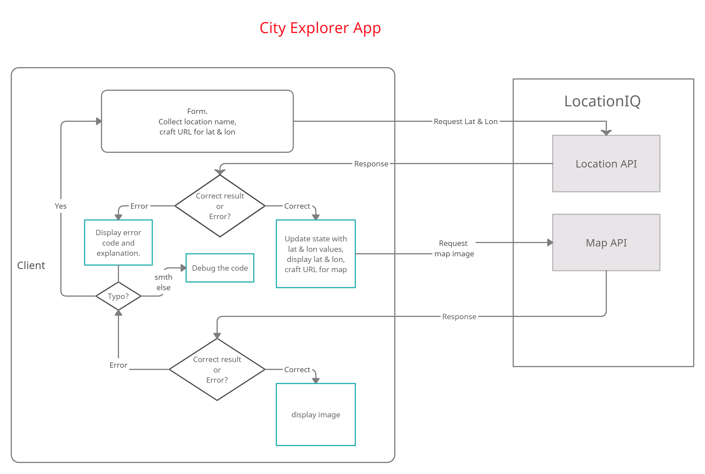

# City Explorer App

**Author**: Ayrat Gimranov
**Version**: 1.0.0 (increment the patch/fix version number if you make more commits past your first submission)

## Overview
<!-- Provide a high level overview of what this application is and why you are building it, beyond the fact that it's an assignment for this class. (i.e. What's your problem domain?) -->
This lab introcudes us to sourcing data from APIs and to error handling. It will be requesting a location by user input and returning its latitude, longitute, and a map image using LocationIQ.com data.

## Getting Started
<!-- What are the steps that a user must take in order to build this app on their own machine and get it running? -->
- Set up a new repository using axios and react-bootstrap.

- Get the API access token from LocationIQ and incorporate it into .env file locally.

- Create form that takes in user input in the for of a location

- Displays the lat and lon and the map of the location

## Architecture
<!-- Provide a detailed description of the application design. What technologies (languages, libraries, etc) you're using, and any other relevant design information. -->
- Langauges - HTML, CSS, JavaScript
- Libraries - React, React-bootstrap, Axios,
- Tools - GitHub, Netlify, Trello, Creatly  

## Change Log
<!-- Use this area to document the iterative changes made to your application as each feature is successfully implemented. Use time stamps. Here's an example:

01-01-2001 4:59pm - Application now has a fully-functional express server, with a GET route for the location resource. -->
7/29/2021 1.06 - Feature 1: React repository is set up with API key and Netlify site is deployed.

## Credit and Collaborations
<!-- Give credit (and a link) to other people or resources that helped you build this application. -->

---------------

Name of feature: 1. Set up your React repository & API keys.

Estimate of time needed to complete: 2 hrs

Start time: 8 pm

Finish time: 1.06 am

Actual time needed to complete: 5 hours

-------

Name of feature: 2. Locations: As a user of City Explorer, I want to enter the name of a location so that I can see the exact latitude and longitude of that location.

Estimate of time needed to complete: 2 hrs

Start time: 1.10 am

Finish time: 

Actual time needed to complete: 